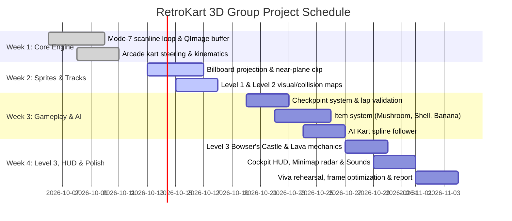

# RetroKart 3D: Project Formulation & Technical Specification
**A Software-Rasterized First-Person Pseudo-3D Racing Engine in Qt**

---

## 1. Executive Summary & Constraints

### 1.1 Objective
Develop a retro, first-person racing game inspired by *Super Mario Kart* and *Super Mario World*, running natively in **C++ with the Qt Framework**. The application simulates a pseudo-3D perspective entirely through **software-based pixel manipulation** (no vector graphics, no OpenGL, no hardware acceleration).

### 1.2 Academic Context & Core Constraints
* **Pure Pixel Manipulation**: All graphics are rasterized directly into an in-memory frame buffer (`QImage`) via CPU calculations. Every ground pixel, sprite pixel, and sky pixel is computed per frame.
* **Low Virtual Grid / Retro Resolution**: The internal game buffer renders at a retro resolution of **$400 \times 300$** or **$320 \times 240$**, scaled up cleanly to the native Qt window using nearest-neighbor scaling to achieve an authentic 16-bit arcade aesthetic with guaranteed 60 FPS performance.
* **Coursework Grounding**: Directly leverages and expands the foundational Computer Graphics algorithms implemented in our prior labs:
  * [transformations](file:///d:/Qt/transformations): Matrix multiplication, 2D/3D affine coordinate transformations.
  * [clipping](file:///d:/Qt/clipping): Near-plane frustum clipping and line-boundary intersection.
  * [bezierCurve](file:///d:/Qt/bezierCurve): Closed-loop track generation, centerline interpolation, and AI waypoints.
  * [drawCircle](file:///d:/Qt/drawCircle) & [drawEllipse](file:///d:/Qt/drawEllipse): Bounding circle collision detection and minimap HUD radar.
  * [fillAlgorithms](file:///d:/Qt/fillAlgorithms): Pixel manipulation, surface masks, and sprite rasterization.

---

## 2. Track Design & 3-Level Progression

Instead of a single track, the game implements three progressively challenging tracks themed after iconic *Super Mario World* environments:

```
+---------------------------------------------------------------------------------+
| Level 1: Donut Plains (Easy)    - Wide track, gentle turns, forgiving grass     |
+---------------------------------------------------------------------------------+
| Level 2: Choco Valley (Medium)  - Moderate width, sharp hairpins, dirt/mud traps|
+---------------------------------------------------------------------------------+
| Level 3: Bowser's Castle (Hard) - Narrow raceway, 90° turns, lethal lava borders|
+---------------------------------------------------------------------------------+
```

### Level 1: "Donut Plains" (Easy)
* **Visual Theme**: Vibrant emerald grass, gray asphalt raceway, red-and-white checkered curbs, bright blue skies with scrolling Mario clouds and green rolling hills.
* **Track Topology**:
  * Track width: **32 world units** (very forgiving).
  * Curvature: Wide, gentle Bézier turns ($R > 80$).
  * Straightaways: Long acceleration zones.
* **Surfaces & Hazards**:
  * *Tarmac*: 100% traction, full acceleration.
  * *Grass Border*: 50% top-speed penalty, moderate drag. No instant-stop barriers.
* **AI Aggression**: 1 rival AI kart; maintains conservative speeds and stays centered on the track spline.

### Level 2: "Choco Valley" (Medium)
* **Visual Theme**: Brown crumbly dirt raceway, mustard-yellow sand runoffs, arid canyon backdrop with multi-layered parallax rock formations.
* **Track Topology**:
  * Track width: **22 world units**.
  * Curvature: Moderate S-curves and one $180^\circ$ hairpin turn requiring throttle feathering/braking.
* **Surfaces & Hazards**:
  * *Hard Dirt*: 90% top speed, increased drift/slip coefficient (longer slide on turns).
  * *Deep Sand*: 30% speed penalty.
  * *Mud Puddles (Hazard Sprites)*: Driving over a mud puddle triggers an immediate 0.5-second spin-out.
* **AI Aggression**: 2 rival AI karts; dynamic overtaking and aggressive corner cutting.

### Level 3: "Bowser's Castle" (Hard)
* **Visual Theme**: Dark cobblestone fortress floor, red glowing molten lava rivers on the borders, fiery volcanic background with thunderstorm sky.
* **Track Topology**:
  * Track width: **14 world units** (very tight raceway).
  * Curvature: Consecutive $90^\circ$ sharp turns and chicanes.
* **Surfaces & Hazards**:
  * *Stone Raceway*: 100% speed, normal grip.
  * *Lava Border (Lethal)*: Unlike grass, touching lava instantly plays a burn effect, resets the player to the nearest previous checkpoint, and incurs a 2-second time penalty.
  * *Thwomp Traps & Fire Bars*: Animated billboard obstacles placed along the track that cycle vertically or rotate.
* **AI Aggression**: 3 rival AI karts; maximum speed and tight racing lines.

---

## 3. Mathematical Formulation (Viva-Defendable Theory)

```
                       FIRST-PERSON CAMERA VIEW
                     
                      Y (Up)
                      ^
                      |       (Eye / Camera)
                      |      o
                      |     /| \
                      |    / |  \  Look Vector
                      |   /  |   \
     -----------------+--/---+----\------------------ Ground Plane (Z, X)
                        /    |     \
                       /     H      \
                      v              v
                  Near Plane      Horizon (y = Height / 2)
```

### 3.1 The Ground Plane: Scanline Inverse Perspective Mapping (Mode 7)
Rather than projecting 3D polygons down to the screen, we compute an **inverse mapping** for each screen row on the lower half of the screen.

#### Derivation (Pinhole Camera & Similar Triangles):
1. **Camera Parameters**:
   * Camera height above ground plane: $H$
   * Focal distance to projection plane: $f$
   * Screen dimensions: $W \times H_{screen}$
   * Horizon row: $y_{\text{horizon}} = \frac{H_{screen}}{2}$
   * Player Kart world position: $(X_k, Z_k)$
   * Player Kart heading (yaw) angle: $\theta$

2. **Ground Distance ($Z_g$) per Screen Row $y$ ($y > y_{\text{horizon}}$)**:
   By similar triangles between the camera eye, focal plane, and ground plane:
   $$\frac{y - y_{\text{horizon}}}{f} = \frac{H}{Z_g} \implies Z_g = \frac{H \cdot f}{y - y_{\text{horizon}}}$$
   *Notice the physical behavior:*
   * As $y \to y_{\text{horizon}}^+$, $(y - y_{\text{horizon}}) \to 0 \implies Z_g \to \infty$ (vanishing point at horizon).
   * As $y \to H_{screen}$, $(y - y_{\text{horizon}})$ is maximized $\implies Z_g$ is minimized (ground immediately beneath the kart).

3. **Horizontal Ground Offset ($X_g$) per Screen Column $x$**:
   Using the horizontal displacement from screen center $(x - x_{\text{center}})$:
   $$\frac{x - x_{\text{center}}}{f} = \frac{X_g}{Z_g} \implies X_g = (x - x_{\text{center}}) \cdot \frac{Z_g}{f} = (x - x_{\text{center}}) \cdot \frac{H}{y - y_{\text{horizon}}}$$

4. **World-to-Track Affine Rotation & Translation**:
   Rotate the local ground coordinates $(X_g, Z_g)$ by the kart’s heading angle $\theta$ (reusing our [Matrix3x3](file:///d:/Qt/transformations/mainwindow.h#L13-L32) transformation principles):
   $$\begin{bmatrix} u \\ v \end{bmatrix} = \begin{bmatrix} \cos\theta & \sin\theta \\ -\sin\theta & \cos\theta \end{bmatrix} \begin{bmatrix} X_g \\ Z_g \end{bmatrix} + \begin{bmatrix} X_k \\ Z_k \end{bmatrix}$$
   Explicitly:
   $$u = X_k + X_g \cos\theta + Z_g \sin\theta$$
   $$v = Z_k - X_g \sin\theta + Z_g \cos\theta$$

5. **Pixel Color Sampling**:
   Sample the pixel from the Track Bitmap at $(u, v)$:
   $$\text{FrameBuffer}(x, y) = \text{TrackTexture}\left( \lfloor u \rfloor \pmod{\text{MapWidth}}, \, \lfloor v \rfloor \pmod{\text{MapHeight}} \right)$$

---

### 3.2 Billboard Sprite Projection (Pipes, Blocks, Shells, Rivals)
Sprites exist at 3D world positions $(obj_x, obj_y, obj_z)$, where $obj_y = 0$ is ground level.

1. **World-to-Camera Coordinate Transformation**:
   Translate relative to the player kart and rotate by negative heading $-\theta$:
   $$\Delta x = obj_x - X_k, \quad \Delta z = obj_z - Z_k$$
   $$X_{\text{cam}} = \Delta x \cos(-\theta) - \Delta z \sin(-\theta) = \Delta x \cos\theta + \Delta z \sin\theta$$
   $$Z_{\text{cam}} = \Delta x \sin(-\theta) + \Delta z \cos(-\theta) = -\Delta x \sin\theta + \Delta z \cos\theta$$

2. **Near-Plane Clipping**:
   If $Z_{\text{cam}} \le Z_{\text{near}}$ ($Z_{\text{near}} = 1.0$), the object lies behind the camera or clips into the lens. Discard the object immediately. This prevents division by zero and inversion artifacts (drawing behind the camera).

3. **Perspective Projection & Scaling**:
   $$x_{\text{screen}} = x_{\text{center}} + \frac{f \cdot X_{\text{cam}}}{Z_{\text{cam}}}$$
   $$y_{\text{screen}} = y_{\text{horizon}} + \frac{f \cdot (H - obj_y)}{Z_{\text{cam}}}$$
   $$\text{scale} = \frac{f}{Z_{\text{cam}}}$$
   $$\text{renderWidth} = \text{spriteWidth} \cdot \text{scale}, \quad \text{renderHeight} = \text{spriteHeight} \cdot \text{scale}$$

4. **Depth Sorting (Painter’s Algorithm)**:
   Sort all visible sprites in descending order of $Z_{\text{cam}}$ ($Z_{\text{farthest}}$ rendered first). Rasterize sprite pixels column by column, skipping transparent/color-keyed pixels (`0x00000000` or Magenta `0xFF00FF`).

---

### 3.3 Parallax Skybox (Horizon Wrap)
For the upper half of the screen ($y \le y_{\text{horizon}}$):
* The background image (clouds, hills, castle spires) wraps horizontally based on kart yaw $\theta$:
  $$u_{\text{sky}} = \left( \lfloor \frac{\theta}{2\pi} \cdot \text{SkyWidth} \rfloor + x \right) \pmod{\text{SkyWidth}}$$
* Sample row: $v_{\text{sky}} = \lfloor \frac{y}{y_{\text{horizon}}} \cdot \text{SkyHeight} \rfloor$.
* Rotating the kart creates smooth horizontal parallax in the background.

---

### 3.4 Bézier Curve Splines for Track & AI Pathing
Directly applying [bezierCurve](file:///d:/Qt/bezierCurve/mainwindow.cpp):
* The track centerline is defined by cubic Bézier segments with $C^1$ continuity:
  $$P(t) = (1-t)^3 P_0 + 3(1-t)^2 t P_1 + 3(1-t) t^2 P_2 + t^3 P_3, \quad t \in [0, 1]$$
* **Track Generation**: We discretize $P(t)$ into $N$ waypoints. At each waypoint, normal vectors $\vec{N}(t) = (-P'_z(t), P'_x(t))$ define track road borders at distance $\pm W_{\text{track}} / 2$.
* **AI Steering**: AI karts steer toward a lookahead point $P(t + \delta t)$ along the spline.

---

## 4. Physics & Computational Geometry

```
                    DUAL-BUFFER MASK PIPELINE
                    
    [ Visual Track Image ]                 [ Material Mask Image ]
    (Rendered to Player Screen)             (Queried by Physics Engine)
    
     +--------------------+                 +--------------------+
     |   Green Grass      |                 |   Green (#00FF00)  | -> 40% Speed
     |   Gray Asphalt     |   -------->     |   White (#FFFFFF)  | -> 100% Speed
     |   Red Wall/Border  |                 |   Red   (#FF0000)  | -> Wall Collision
     |   Yellow Line      |                 |   Yellow(#FFFF00)  | -> Checkpoint
     +--------------------+                 +--------------------+
```

### 4.1 Dual-Map Spatial Hashing
Instead of testing complex polygon meshes, we maintain a synchronized 2D **Material Mask Image**:
* Sample the pixel at $(u, v) = (\lfloor X_k \rfloor, \lfloor Z_k \rfloor)$ on the mask:
  * `#FFFFFF` (Tarmac): Max speed = $100\%$, drag = normal.
  * `#00FF00` (Grass/Sand): Max speed = $35\%$, drag = $3.5\times$ normal.
  * `#FF0000` (Wall/Barrier): Triggers collision response.
  * `#0000FF` (Boost Pad): Sets instantaneous impulse speed = $140\%$ for 1.5 seconds.
  * `#FFFF00` (Checkpoint): Triggers sequential lap progress logic.
  * `#FF00FF` (Lava - Level 3): Triggers hazard reset and penalty timer.

### 4.2 Arcade Kinematics Model
```cpp
struct KartState {
    double x, z;          // World coordinates
    double angle;         // Heading (yaw) in radians
    double speed;         // Current forward velocity
    double maxSpeed;      // Max speed (surface dependent)
    double accel;         // Acceleration scalar
    double friction;      // Damping coefficient
    double turnRate;      // Steering sensitivity
    bool isSpinning;      // Banana/mud trap state
    double spinTimer;     // Spin recovery timer
};
```

* **Throttle / Braking**:
  * Forward (`W` / `Up`): $\text{speed} = \min(\text{speed} + \text{accel} \cdot \Delta t, \text{maxSpeed})$
  * Reverse/Brake (`S` / `Down`): $\text{speed} = \max(\text{speed} - \text{brake} \cdot \Delta t, -\text{maxSpeed} \cdot 0.3)$
  * Idle: $\text{speed} = \text{speed} \cdot (1.0 - \text{friction} \cdot \Delta t)$
* **Speed-Coupled Steering**:
  $$\frac{d\theta}{dt} = \text{steerInput} \cdot \text{turnRate} \cdot \left( \frac{\text{speed}}{\text{maxSpeed}} \right)$$
  *(Prevents turning while stationary; creates realistic vehicle momentum).*
* **Position Integration**:
  $$X_k \mathrel{+}= \text{speed} \cdot \sin\theta \cdot \Delta t$$
  $$Z_k \mathrel{+}= \text{speed} \cdot \cos\theta \cdot \Delta t$$

### 4.3 Wall Collision & Tangential Slide
When the predicted position $(X_{\text{next}}, Z_{\text{next}})$ lands on a wall pixel:
1. Sample surrounding mask pixels to approximate the wall surface normal $\vec{n} = (n_x, n_z)$.
2. Decompose velocity vector $\vec{v}$ into normal and tangential components:
   $$\vec{v}_n = (\vec{v} \cdot \vec{n})\vec{n}, \quad \vec{v}_t = \vec{v} - \vec{v}_n$$
3. Cancel or reflect $\vec{v}_n$ and preserve friction-dampened tangential velocity $\vec{v}_t$:
   $$\vec{v}_{\text{new}} = 0.7 \cdot \vec{v}_t - 0.2 \cdot \vec{v}_n$$
   *Result:* The kart glides smoothly along the guardrail instead of getting stuck inside the wall.

### 4.4 Lap Verification & Anti-Cheat System
* 4–6 oriented line checkpoints are placed around the track.
* Each checkpoint is represented as a directed segment $\overline{AB}$.
* A checkpoint cross occurs when the line segment formed by $(X_{\text{prev}}, Z_{\text{prev}}) \to (X_{\text{curr}}, Z_{\text{curr}})$ intersects $\overline{AB}$ with a positive dot product along the track direction.
* A lap counter increments **only** if checkpoints are completed sequentially: $CP_0 \to CP_1 \to CP_2 \to CP_3 \to CP_0$.

---

## 5. Mario World Gameplay Features

```
[?] Mystery Box Collision ---> Item Slot Animation ---> Item Selected
                                                           |
           +-----------------------+-----------------------+
           |                       |                       |
       [Mushroom]             [Green Shell]            [Banana]
   Speed x1.5 Boost       Ballistic Projectile    Stationary Trap
   FOV Expansion + Shake  Wall Bounce & Hit AI    Forces 360° Spin
```

1. **[?] Mystery Boxes**:
   * Billboard sprites floating at fixed positions.
   * On circle collision, the box vanishes (respawning after 10s) and triggers a roulette item box on the HUD.
2. **Super Mushroom**:
   * Increases `maxSpeed` by $50\%$ and sets current speed to max for 3.0 seconds.
   * *Graphics Effect:* Temporarily increase focal length $f$ by $15\%$ and add minor camera jitter to create a dramatic sense of warp/speed.
3. **Green Shell**:
   * Spawns at $(X_k + 2\sin\theta, Z_k + 2\cos\theta)$ and travels straight along heading $\theta$ at velocity $\text{speed} + 30$.
   * Bounces off wall pixels up to 3 times before shattering.
   * Triggers a crash/spin-out on any AI kart or player it hits.
4. **Banana Peel**:
   * Dropped directly behind the kart.
   * If any kart passes within radius $R \le 1.5$, sets `isSpinning = true` for 1.0s and cuts velocity by $60\%$.

---

## 6. Qt System Architecture & Code Structure

### 6.1 Direct Frame Buffer Access in Qt
To achieve 60 FPS without OpenGL, avoid calling `QPainter::drawPoint()` in loops. Use direct 32-bit pixel array access:

```cpp
// Screen buffer allocation
QImage frameBuffer(400, 300, QImage::Format_RGB32);

// Fast scanline pixel pointer
QRgb* pixels = reinterpret_cast<QRgb*>(frameBuffer.bits());

// In the Mode-7 ground loop:
for (int y = horizonY; y < 300; ++y) {
    double zg = (cameraH * focalLength) / (y - horizonY);
    for (int x = 0; x < 400; ++x) {
        double xg = (x - centerX) * (cameraH / (y - horizonY));
        int u = static_cast<int>(kartX + xg * cosA + zg * sinA) & (MAP_W - 1);
        int v = static_cast<int>(kartZ - xg * sinA + zg * cosA) & (MAP_H - 1);
        
        pixels[y * 400 + x] = trackPixels[v * MAP_W + u];
    }
}
```

### 6.2 Display in Qt
In your custom `QWidget::paintEvent`:
```cpp
void GameWidget::paintEvent(QPaintEvent* event) {
    QPainter painter(this);
    // Nearest-neighbor upscale to fill the window cleanly
    painter.setRenderHint(QPainter::SmoothPixmapTransform, false);
    painter.drawImage(rect(), frameBuffer);
}
```

### 6.3 Game Loop Structure
```cpp
// In GameWidget constructor:
gameTimer = new QTimer(this);
connect(gameTimer, &QTimer::timeout, this, &GameWidget::gameLoop);
gameTimer->start(16); // 16.6ms = 60 FPS

void GameWidget::gameLoop() {
    constexpr double dt = 0.016;
    processKeyboardInput();
    updatePhysics(dt);
    updateAI(dt);
    updateProjectiles(dt);
    
    renderSky();
    renderGroundMode7();
    renderBillboardSprites();
    renderCockpitAndHUD();
    
    this->update(); // Schedules Qt repaint
}
```

---

## 7. Viva Defense Cheatsheet

Prepare these exact answers for your oral examination:

* **Q: Why is this considered 3D if you're not using OpenGL or a 3D graphics API?**
  * **Answer:** *"We implement a software-rasterized perspective projection pipeline using the pinhole camera model. For the ground plane, we derive the exact mathematical relationship between screen row $y$ and world depth $Z$ using similar triangles ($Z = \frac{H \cdot f}{y - y_{\text{horizon}}}$). For objects, we perform 3D-to-camera affine coordinate transformations, near-plane frustum clipping, and perspective division ($1/Z$). All projection mathematics are computed explicitly in C++ on the CPU."*
* **Q: How does your near-plane clipping work, and why is it necessary?**
  * **Answer:** *"When an object is transformed into camera space, we test its depth coordinate $Z_{\text{cam}}$. If $Z_{\text{cam}} \le Z_{\text{near}}$ (where $Z_{\text{near}} > 0$), we cull the sprite before projection. Without near-plane clipping, an object passing behind the camera would yield a negative $Z$, causing division-by-zero or inverted projection where objects behind the player appear flipped on screen."*
* **Q: What is the time complexity of your ground rasterizer?**
  * **Answer:** *"For a screen of resolution $W \times H$, the lower half has $\frac{H}{2}$ scanlines. The ground loop executes exactly $W \times \frac{H}{2}$ iterations per frame. With $W=400$ and $H=300$, that is exactly $60,000$ operations per frame. At 60 FPS, this requires $3.6 \times 10^6$ operations per second, which modern CPU cores execute in under $2$ milliseconds, easily sustaining 60 FPS."*
* **Q: How do you prevent sprite z-fighting or wrong occlusion without a hardware Z-buffer?**
  * **Answer:** *"We use the Painter's Algorithm. We compute $Z_{\text{cam}}$ for all visible entities and sort them in descending order ($O(N \log N)$, where $N < 30$). Farthest sprites are drawn first and closer sprites overwrite them. Ground is drawn first, sprites second, and the cockpit HUD overlay last."*

---

## 8. Group Task Allocation (4 Members)

| Role | Primary Deliverables | Files/Classes Owned |
| :--- | :--- | :--- |
| **Member 1 (Math & Core Rasterizer)** | • Mode-7 inverse perspective scanline loop<br>• Parallax skybox scrolling<br>• Camera height, horizon, and FOV mathematics | `rasterizer.h`, `rasterizer.cpp`, `camera.h` |
| **Member 2 (Sprites & Projections)** | • World-to-camera transformation matrix<br>• Near-plane clipping & $1/Z$ scaling<br>• Depth sorting (Painter's Algorithm) & sprite rendering | `sprite_manager.h`, `sprite_manager.cpp`, `billboard.h` |
| **Member 3 (Physics & Collisions)** | • Dual-map material mask reader<br>• Arcade kart kinematics (velocity, drag, friction)<br>• Wall sliding response & checkpoint lap system | `kart_physics.h`, `kart_physics.cpp`, `collision.h` |
| **Member 4 (Game Logic, UI & Levels)** | • 3 Track asset maps (Easy, Medium, Hard)<br>• Item system (Mushroom, Shell, Banana)<br>• HUD overlay (Speedometer, Minimap radar, Lap timer) | `gamewidget.cpp`, `hud.h`, `item_system.h`, `track_loader.h` |

---

## 9. 4-Week Development Roadmap


